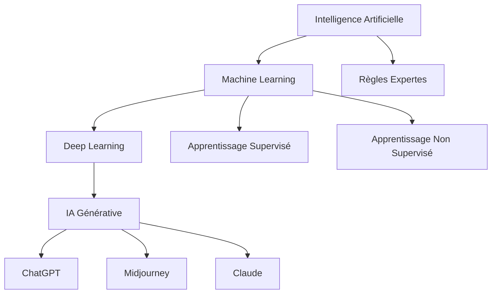
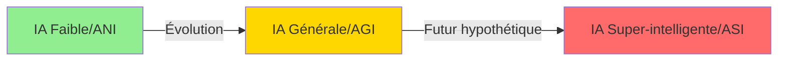
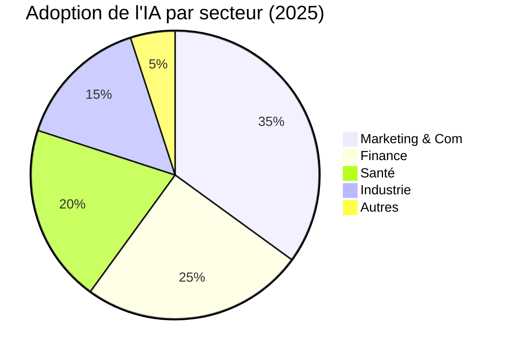

# Module 1 : Introduction et fondamentaux de l'IA
## Durée : 2 heures


*L'Intelligence Artificielle transforme notre monde*

---

## 🎯 Objectifs du module

À la fin de ce module, vous serez capable de :
- Comprendre les concepts fondamentaux de l'intelligence artificielle
- Distinguer les différents types d'IA et leurs applications
- Identifier les principaux outils d'IA disponibles sur le marché
- Évaluer les opportunités et limites de l'IA dans votre contexte professionnel

---

## 📚 Leçon 1 : Qu'est-ce que l'Intelligence Artificielle ?

### 1.1 Définition et concepts clés


*Représentation conceptuelle de l'Intelligence Artificielle*

L'**Intelligence Artificielle (IA)** est la simulation de processus d'intelligence humaine par des machines, notamment des systèmes informatiques. Ces processus incluent :
- L'apprentissage (acquisition d'informations et règles)
- Le raisonnement (utilisation de règles pour atteindre des conclusions)
- L'auto-correction

### 1.2 Les trois piliers de l'IA moderne


*Les fondations de l'IA moderne : ML, DL et IA Générative*



#### 🧠 **Machine Learning (Apprentissage automatique)**
- Permet aux machines d'apprendre sans être explicitement programmées
- Se base sur des modèles statistiques et des algorithmes
- Améliore ses performances avec l'expérience

**Exemple concret :** Un système de recommandation Netflix qui apprend de vos préférences de visionnage pour suggérer de nouveaux contenus.

#### 🔮 **Deep Learning (Apprentissage profond)**
- Sous-ensemble du Machine Learning
- Utilise des réseaux de neurones artificiels à plusieurs couches
- Excelle dans la reconnaissance de patterns complexes

**Exemple concret :** La reconnaissance faciale sur votre smartphone qui déverrouille l'appareil.

#### 💬 **IA Générative**
- Crée du nouveau contenu (texte, images, audio, vidéo)
- Se base sur des modèles entraînés sur d'énormes quantités de données
- Peut produire des résultats originaux et créatifs

**Exemple concret :** ChatGPT générant une réponse unique à votre question.

---

## 📚 Leçon 2 : Les différents types d'IA


*Évolution et classification de l'Intelligence Artificielle*

### 2.1 Classification par capacités



| Type d'IA | Description | Exemples | État actuel |
|-----------|-------------|----------|-------------|
| **IA Faible (Narrow AI)** | Spécialisée dans une tâche spécifique | Siri, Alexa, filtres anti-spam | ✅ Disponible |
| **IA Générale (AGI)** | Capacités cognitives humaines complètes | Aucun exemple actuel | 🔬 En recherche |
| **IA Super-intelligente** | Surpasse l'intelligence humaine | Science-fiction | 🚫 Théorique |

### 2.2 Classification par fonctionnalités

#### 🤖 **IA Réactive**
- Pas de mémoire
- Réagit uniquement aux stimuli actuels
- Exemple : Deep Blue (échecs d'IBM)

#### 🧠 **IA à Mémoire Limitée**
- Utilise les données passées pour les décisions futures
- Durée de mémoire limitée
- Exemple : Voitures autonomes

#### 💭 **IA Théorie de l'Esprit**
- Comprend les émotions et pensées humaines
- En développement
- Exemple : Assistants émotionnels avancés (futurs)

#### 🌟 **IA Consciente**
- Conscience de soi
- Purement théorique
- Exemple : Vision futuriste

---

## 📚 Leçon 3 : Applications concrètes de l'IA


*L'IA révolutionne tous les secteurs d'activité*

### 3.1 Dans le monde professionnel



#### 📊 **Marketing & Communication**
- Personnalisation des campagnes
- Analyse prédictive du comportement client
- Création de contenu automatisée
- Chatbots et service client 24/7

**Cas pratique :** L'Oréal utilise l'IA pour personnaliser les recommandations de produits via son application mobile, augmentant les conversions de 35%.

#### 🏥 **Santé**
- Diagnostic assisté par IA
- Découverte de médicaments
- Chirurgie robotisée
- Prédiction d'épidémies

**Cas pratique :** IBM Watson aide les oncologues à identifier les traitements personnalisés du cancer avec 96% de concordance avec les experts humains.

#### 💰 **Finance**
- Détection de fraudes
- Trading algorithmique
- Évaluation du risque de crédit
- Conseil financier automatisé

**Cas pratique :** JPMorgan utilise COiN (Contract Intelligence) pour analyser 12 000 accords commerciaux en quelques secondes (vs 360 000 heures humaines).

#### 🏭 **Industrie**
- Maintenance prédictive
- Optimisation de la chaîne d'approvisionnement
- Contrôle qualité automatisé
- Robotique collaborative

### 3.2 Dans la vie quotidienne

- **Assistants vocaux** : Siri, Google Assistant, Alexa
- **Recommandations** : Netflix, Spotify, YouTube
- **Navigation** : Google Maps, Waze
- **Réseaux sociaux** : Filtres Instagram, suggestions d'amis Facebook
- **E-commerce** : Recommandations Amazon, recherche visuelle

---

## 📚 Leçon 4 : Les outils IA populaires


*L'écosystème des outils IA en 2025*

### 4.1 Outils de génération de texte

#### **ChatGPT (OpenAI)**
- **Forces** : Polyvalent, conversationnel, multilingue, GPT-4o avec capacités multimodales
- **Utilisations** : Rédaction, traduction, code, analyse, vision par ordinateur
- **Limites** : Peut halluciner, coût API pour usage intensif

#### **Claude (Anthropic)**
- **Forces** : Précis, éthique, fenêtre de contexte de 200K tokens, Claude 3.5 Sonnet très performant
- **Utilisations** : Analyse de documents, rédaction longue, code complexe
- **Limites** : Accès plus limité que ChatGPT

#### **Gemini (Google)**
- **Forces** : Intégration Google, multimodal natif, Gemini 2.0 très performant
- **Utilisations** : Recherche, analyse d'images et vidéos, intégration Workspace
- **Limites** : Disponibilité variable selon les régions

#### **Copilot (Microsoft)**
- **Forces** : Intégration Office, productivité
- **Utilisations** : Documents professionnels, code
- **Limites** : Nécessite abonnement Microsoft

### 4.2 Outils de génération d'images


*Outils de génération d'images par IA*

| Outil | Forces | Cas d'usage | Prix |
|-------|--------|-------------|------|
| **Midjourney** | Qualité artistique | Art conceptuel | 10$/mois |
| **DALL-E 3** | Intégration ChatGPT | Illustrations | 20$/mois |
| **Stable Diffusion** | Open source | Personnalisation | Gratuit |
| **Adobe Firefly** | Intégration Creative Cloud | Design pro | 50$/mois |

### 4.3 Comparatif des plateformes

```
🏆 Meilleur pour les débutants : ChatGPT
🎨 Meilleur pour la créativité : Midjourney
💼 Meilleur pour l'entreprise : Microsoft Copilot
🔧 Meilleur pour les développeurs : GitHub Copilot
📊 Meilleur pour l'analyse : Claude
```

---

## 🏃 Exercices pratiques


*La pratique est la clé de la maîtrise de l'IA*

### Exercice 1 : Identification des types d'IA
**Durée : 10 minutes**

Classifiez les applications suivantes selon le type d'IA :
1. Un filtre anti-spam Gmail
2. Un robot aspirateur Roomba
3. L'assistant Alexa
4. Le système de recommandation TikTok
5. Un chatbot de service client

**Correction :**
1. IA Faible - Machine Learning
2. IA à Mémoire Limitée
3. IA Faible - Traitement du langage naturel
4. IA Faible - Deep Learning
5. IA Faible - Règles + ML

### Exercice 2 : Analyse de cas d'usage
**Durée : 15 minutes**

Pour votre entreprise ou secteur d'activité, identifiez :
- 3 tâches répétitives pouvant être automatisées par l'IA
- 2 processus de décision pouvant être assistés par l'IA
- 1 nouvelle opportunité créée par l'IA générative

**Exemple de réponse (secteur e-commerce) :**
- Tâches répétitives : réponses FAQ, catégorisation produits, génération descriptions
- Processus de décision : pricing dynamique, stock prévisionnel
- Nouvelle opportunité : assistant shopping personnalisé

### Exercice 3 : Première interaction avec l'IA
**Durée : 20 minutes**

1. Accédez à ChatGPT (chat.openai.com) ou Claude (claude.ai)
2. Posez 5 questions différentes :
   - Une question factuelle
   - Une demande de création
   - Une analyse
   - Une traduction
   - Un problème à résoudre
3. Évaluez la qualité des réponses

---

## 💡 Points clés à retenir

✅ **L'IA est déjà partout** : Elle influence déjà notre quotidien et nos métiers

✅ **Trois niveaux de compréhension** : IA ≠ Machine Learning ≠ Deep Learning

✅ **Opportunités vs Limites** : L'IA excelle dans les tâches répétitives mais nécessite supervision humaine

✅ **Évolution rapide** : Les outils évoluent constamment, l'important est de comprendre les principes

✅ **Approche pratique** : La meilleure façon d'apprendre est d'expérimenter

---

## 🔗 Ressources complémentaires

### Articles recommandés
- "What is AI?" - MIT Technology Review
- "The State of AI Report 2025" - Nathan Benaich
- "IA pour les nuls" - Microsoft Learn
- "Guide pratique de l'IA en entreprise" - McKinsey 2025

### Vidéos
- "But what is a neural network?" - 3Blue1Brown (20 min)
- "How AI Works" - IBM Think (15 min)

### Podcasts
- "The AI Podcast" - NVIDIA
- "Eye on AI" - Craig Smith

---

## ❓ Quiz d'auto-évaluation

1. **Quelle est la différence principale entre Machine Learning et Deep Learning ?**
   - a) Il n'y a pas de différence
   - b) Le Deep Learning utilise des réseaux de neurones profonds
   - c) Le Machine Learning est plus récent
   - d) Le Deep Learning ne nécessite pas de données

2. **Quel type d'IA ChatGPT représente-t-il ?**
   - a) IA Super-intelligente
   - b) IA Générale (AGI)
   - c) IA Faible spécialisée
   - d) IA Consciente

3. **Quelle application N'EST PAS un exemple d'IA générative ?**
   - a) Midjourney
   - b) ChatGPT
   - c) Google Maps
   - d) DALL-E

**Réponses : 1-b, 2-c, 3-c**

---

## 🚀 Prochaine étape

Dans le Module 2, nous approfondirons l'IA générative et apprendrons à maîtriser l'art du Prompt Engineering pour obtenir les meilleurs résultats de ces outils puissants.