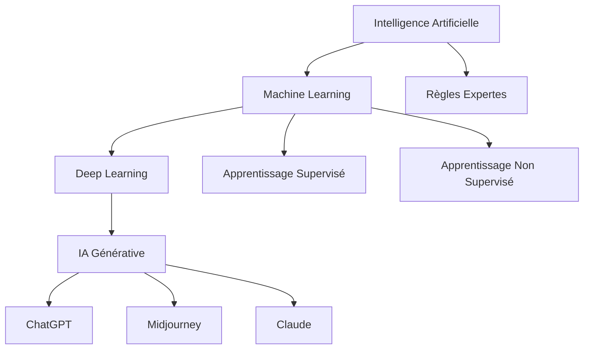
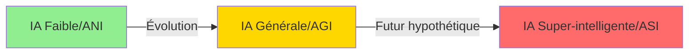
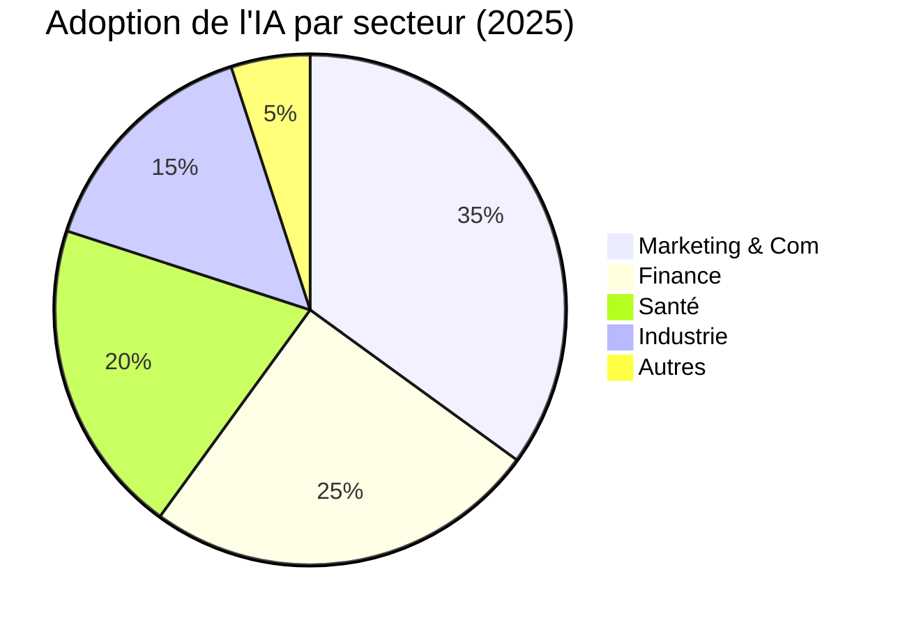

# Ressources Visuelles - Module 1

## Images et illustrations pour enrichir le cours

### 🎨 Images principales intégrées

1. **Banner principal** 
   - Source : Unsplash
   - URL : `https://images.unsplash.com/photo-1677442136019-21780ecad995`
   - Description : Représentation futuriste de l'IA
   - Usage : En-tête du module

2. **Concepts IA**
   - Source : Unsplash
   - URL : `https://images.unsplash.com/photo-1620712943543-bcc4688e7485`
   - Description : Visualisation abstraite de l'IA
   - Usage : Introduction aux concepts

3. **Piliers de l'IA**
   - Source : Unsplash
   - URL : `https://images.unsplash.com/photo-1555255707-c07966088b7b`
   - Description : Représentation des fondations technologiques
   - Usage : Section ML/DL/IA Générative

4. **Types d'IA**
   - Source : Unsplash
   - URL : `https://images.unsplash.com/photo-1635070041078-e363dbe005cb`
   - Description : Classification visuelle
   - Usage : Typologie de l'IA

5. **Applications IA**
   - Source : Unsplash
   - URL : `https://images.unsplash.com/photo-1485827404703-89b55fcc595e`
   - Description : Robot et technologie
   - Usage : Applications sectorielles

6. **Outils IA**
   - Source : Unsplash
   - URL : `https://images.unsplash.com/photo-1563986768609-322da13575f3`
   - Description : Dashboard technologique
   - Usage : Présentation des outils

7. **Génération d'images**
   - Source : Unsplash
   - URL : `https://images.unsplash.com/photo-1686191128892-3e6fdd51fb1c`
   - Description : Art génératif IA
   - Usage : Outils créatifs

8. **Exercices pratiques**
   - Source : Unsplash
   - URL : `https://images.unsplash.com/photo-1434030216411-0b793f4b4173`
   - Description : Étude et apprentissage
   - Usage : Section exercices

### 📊 Diagrammes Mermaid intégrés

#### Hiérarchie de l'IA


#### Évolution de l'IA


#### Adoption par secteur


### 🖼️ Images supplémentaires suggérées

Pour enrichir davantage le module, voici des sources d'images libres de droits :

#### Banques d'images gratuites
- **Unsplash** : https://unsplash.com/s/photos/artificial-intelligence
- **Pexels** : https://www.pexels.com/search/artificial%20intelligence/
- **Pixabay** : https://pixabay.com/images/search/ai/
- **Freepik** : https://www.freepik.com/free-photos-vectors/ai (attribution requise)

#### Icônes et illustrations
- **Flaticon** : https://www.flaticon.com/search?word=artificial%20intelligence
- **Icons8** : https://icons8.com/illustrations/tag/artificial-intelligence
- **unDraw** : https://undraw.co/search (illustrations open source)

### 📈 Infographies recommandées

#### Timeline de l'évolution de l'IA
```
1950 → Test de Turing
1956 → Naissance de l'IA (Dartmouth)
1997 → Deep Blue bat Kasparov
2012 → AlexNet révolutionne le Deep Learning
2016 → AlphaGo bat Lee Sedol
2020 → GPT-3 démocratise l'IA
2022 → ChatGPT explose
2023 → IA générative mainstream
2024 → Claude 3, GPT-4o, Gemini
2025 → Agents IA autonomes
```

#### Comparaison des modèles
```
Modèle         | Paramètres | Contexte    | Multimodal
---------------|------------|-------------|------------
GPT-4o         | 1.8T       | 128K tokens | ✅
Claude 3.5     | ?          | 200K tokens | ✅
Gemini 2.0     | ?          | 2M tokens   | ✅
Llama 3        | 405B       | 128K tokens | ❌
```

### 🎨 Création de visuels personnalisés

#### Avec Canva (gratuit)
1. Templates "Intelligence Artificielle" disponibles
2. Infographies éditables
3. Diagrammes et schémas
4. Export en haute résolution

#### Avec Figma (gratuit)
1. Création de workflows visuels
2. Diagrammes interactifs
3. Mockups d'interfaces IA
4. Collaboration en temps réel

#### Avec Midjourney (pour illustrations custom)
Prompts suggérés :
```
"minimalist illustration of artificial intelligence concept, 
blue and white color scheme, clean design, educational poster style --ar 16:9"

"futuristic classroom with AI holographic teacher, 
students learning, bright colors, optimistic mood --ar 16:9"

"abstract visualization of machine learning process, 
neural network, data flow, purple gradient --ar 1:1"
```

### 💡 Conseils d'utilisation

1. **Cohérence visuelle** : Maintenir une palette de couleurs cohérente (bleu tech, violet IA, vert données)

2. **Accessibilité** : Toujours ajouter un texte alternatif aux images pour l'accessibilité

3. **Optimisation** : Compresser les images pour un chargement rapide (TinyPNG, Squoosh)

4. **Attribution** : Respecter les licences et créditer les sources si nécessaire

5. **Format** : Privilégier le format WebP pour le web, PNG pour les diagrammes, JPG pour les photos

### 🔄 Mise à jour régulière

Les visuels doivent être mis à jour régulièrement pour refléter :
- Les nouvelles versions des outils
- Les dernières tendances UI/UX
- Les évolutions technologiques
- Les retours des apprenants

---

*Document créé par Antoine AP - antoine.ap.57@gmail.com*
*Dernière mise à jour : Janvier 2025*