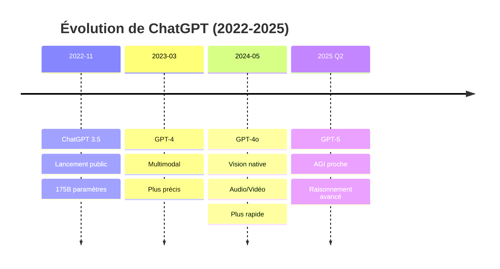
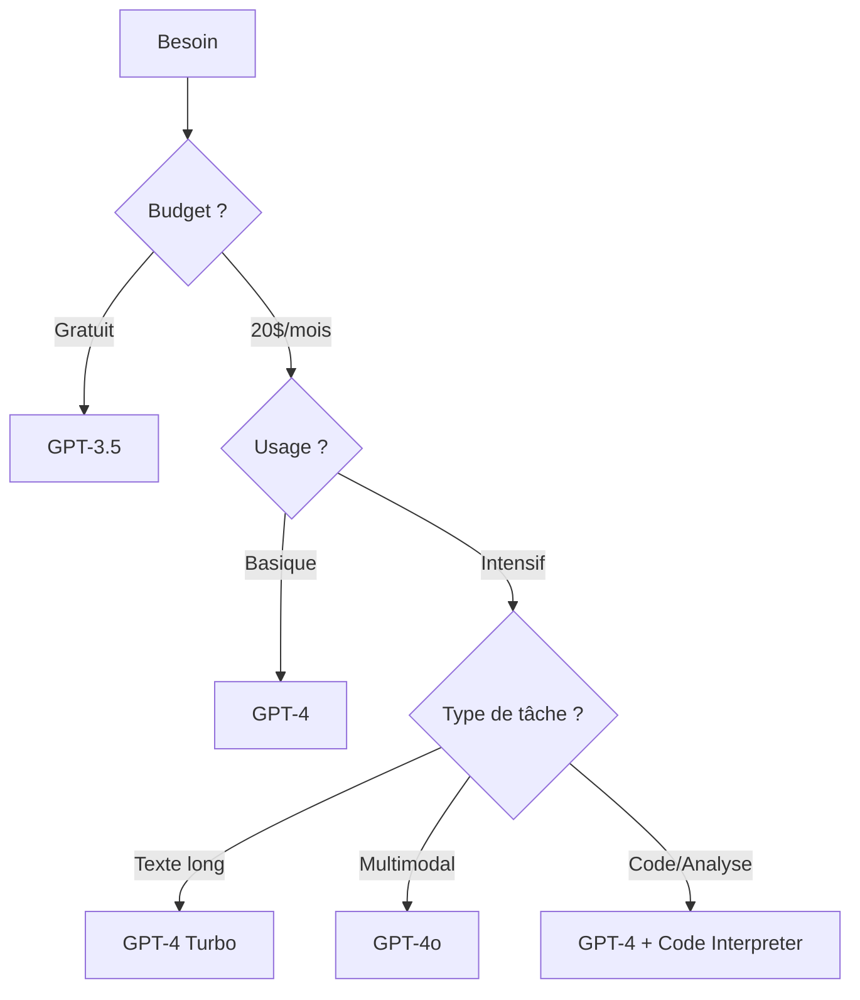
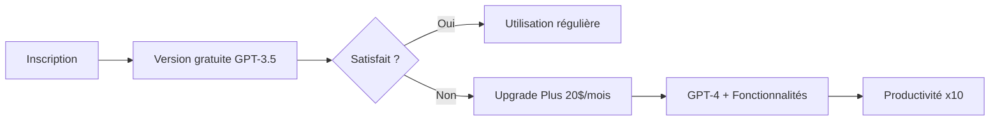

# Module 2 : IA Générative & Prompt Engineering - Maîtrise de ChatGPT
## Durée : 3 heures


*ChatGPT et l'IA conversationnelle : votre assistant intelligent*

---

## 🎯 Objectifs du module

À la fin de ce module, vous serez capable de :
- ✅ Comprendre en profondeur le fonctionnement de ChatGPT et des LLM
- ✅ Maîtriser toutes les fonctionnalités de ChatGPT (GPT-4, GPT-4o, plugins, vision)
- ✅ Créer des prompts efficaces et optimisés pour tout cas d'usage
- ✅ Utiliser ChatGPT pour des tâches professionnelles complexes
- ✅ Éviter les pièges courants et maximiser la qualité des réponses
- ✅ Construire une bibliothèque de prompts réutilisables

---

## 📚 Leçon 1 : Comprendre ChatGPT en profondeur

### 1.1 Qu'est-ce que ChatGPT exactement ?


*L'architecture révolutionnaire de ChatGPT*

**ChatGPT** (Chat Generative Pre-trained Transformer) est un modèle de langage développé par OpenAI, basé sur l'architecture GPT (Generative Pre-trained Transformer). Il représente une avancée majeure dans l'IA conversationnelle.

#### 📊 **Évolution des versions ChatGPT**



#### 🧠 **Comment ChatGPT traite vos requêtes**

**Processus détaillé :**

1. **Réception de votre prompt**
   - Analyse de l'intention
   - Identification du contexte
   - Détection de la langue

2. **Tokenisation intelligente**
   ```
   Votre texte : "Comment créer une stratégie marketing ?"
   Tokens : ["Comment", "créer", "une", "strat", "égie", "marketing", "?"]
   Tokens IDs : [7967, 5454, 1245, 8974, 2341, 9876, 30]
   ```

3. **Encodage et embeddings**
   - Chaque token → vecteur de 12,288 dimensions (GPT-4)
   - Capture du sens contextuel
   - Relations sémantiques

4. **Mécanisme d'attention**
   - Analyse des relations entre tous les mots
   - Pondération de l'importance
   - Context window : 128,000 tokens (GPT-4 Turbo)

5. **Génération de la réponse**
   - Prédiction token par token
   - Échantillonnage selon la température
   - Vérification de cohérence

### 1.2 Les différentes versions de ChatGPT

#### 🎯 **Comparaison des versions disponibles**

| Caractéristique | GPT-3.5 | GPT-4 | GPT-4 Turbo | GPT-4o |
|----------------|---------|--------|-------------|---------|
| **Disponibilité** | Gratuit | Plus (20$/mois) | Plus | Plus |
| **Contexte** | 4,096 tokens | 8,192 tokens | 128,000 tokens | 128,000 tokens |
| **Vitesse** | Très rapide | Lent | Rapide | Très rapide |
| **Précision** | Bonne | Excellente | Excellente | Excellente |
| **Vision** | ❌ | ✅ | ✅ | ✅ Native |
| **Création images** | ❌ | DALL-E 3 | DALL-E 3 | DALL-E 3 |
| **Browsing** | ❌ | ✅ | ✅ | ✅ |
| **Code Interpreter** | ❌ | ✅ | ✅ | ✅ |
| **Plugins** | ❌ | ✅ | ✅ | Intégrés |
| **Coût API** | $0.002/1K | $0.03/1K | $0.01/1K | $0.005/1K |

#### 💡 **Quelle version choisir ?**



### 1.3 Fonctionnalités avancées de ChatGPT Plus

#### 🎨 **DALL-E 3 intégré**
- Génération d'images directement dans le chat
- Édition et variations
- Respect du style demandé

**Exemple de prompt image :**
```
Crée une illustration minimaliste d'un bureau moderne avec 
une plante verte, un MacBook et une tasse de café, 
style flat design, couleurs pastel
```

#### 🔍 **Browsing (Navigation web)**
- Recherche en temps réel
- Accès aux informations actuelles
- Vérification de faits
- Analyse de pages web

**Exemple d'utilisation :**
```
Recherche les dernières actualités sur l'IA générative 
de cette semaine et fais-moi un résumé des 5 points clés
```

#### 💻 **Code Interpreter (Analyse de données)**
- Exécution de code Python
- Analyse de fichiers CSV/Excel
- Création de graphiques
- Traitement d'images
- Calculs complexes

**Exemple pratique :**
```
Voici mon fichier de ventes. Analyse les tendances, 
crée des visualisations et identifie les produits 
les plus performants par trimestre
```

#### 👁️ **Vision (GPT-4V)**
- Analyse d'images
- OCR (extraction de texte)
- Description détaillée
- Identification d'objets
- Aide au design

**Cas d'usage :**
```
[Upload image] Analyse cette maquette de site web 
et suggère des améliorations UX/UI
```

### 1.4 Configuration optimale de ChatGPT

#### ⚙️ **Paramètres personnalisés (Custom Instructions)**


*Optimisez ChatGPT selon vos besoins*

**Configuration recommandée :**

```
📝 What would you like ChatGPT to know about you?
- Je suis [votre métier/rôle]
- Je travaille dans [secteur/industrie]
- Mes objectifs principaux sont [objectifs]
- J'utilise principalement [outils/logiciels]
- Mon niveau technique est [débutant/intermédiaire/avancé]

💬 How would you like ChatGPT to respond?
- Réponses concises et orientées action
- Format structuré avec bullets points
- Exemples concrets et applicables
- Ton professionnel mais accessible
- Toujours proposer des alternatives
```

#### 🎛️ **Paramètres API avancés**

| Paramètre | Description | Impact | Cas d'usage |
|-----------|-------------|--------|------------|
| **Temperature** | Créativité des réponses | 0 = Factuel<br>1 = Créatif | 0.3 : Code/Analyse<br>0.7 : Contenu<br>0.9 : Brainstorming |
| **Top-p** | Diversité du vocabulaire | 0.1 = Précis<br>1 = Varié | 0.5 : Technique<br>0.9 : Créatif |
| **Max tokens** | Longueur maximale | 100-4000 | Email : 500<br>Article : 2000 |
| **Frequency penalty** | Évite répétitions | -2 à 2 | 0.5 : Standard<br>1 : Très varié |
| **Presence penalty** | Nouveaux sujets | -2 à 2 | 0.3 : Cohérent<br>0.7 : Exploratoire |

---

## 📚 Leçon 2 : Maîtrise complète de ChatGPT

### 2.1 Guide d'utilisation pas à pas

#### 🚀 **Premier contact avec ChatGPT**



#### 📱 **Interface et fonctionnalités**

**Zone de conversation :**
- **Nouveau chat** : Commencer une nouvelle conversation
- **Historique** : Accès aux conversations précédentes
- **Recherche** : Retrouver des échanges spécifiques
- **Partage** : Créer des liens de partage
- **Export** : Télécharger les conversations

**Raccourcis clavier essentiels :**
- `Ctrl/Cmd + K` : Nouvelle conversation
- `Ctrl/Cmd + Shift + C` : Copier le dernier message
- `Ctrl/Cmd + /` : Voir tous les raccourcis
- `↑` : Éditer le dernier message envoyé

### 2.2 Techniques de conversation efficaces

#### 💬 **L'art de la conversation itérative**

**Mauvaise approche :**
```
User : Écris un article sur le marketing
ChatGPT : [Article générique de 500 mots]
User : C'est nul, recommence
```

**Bonne approche :**
```
User : Je veux créer un article sur le marketing digital pour 
des PME du secteur e-commerce. Commence par me proposer 
5 angles d'approche différents

ChatGPT : Voici 5 angles possibles...

User : J'aime l'angle #3 sur le ROI. Développe un plan 
détaillé en 5 sections avec les points clés

ChatGPT : Plan structuré...

User : Parfait. Maintenant rédige l'introduction et la 
première section. Ton : professionnel mais accessible. 
300 mots max.
```

#### 🔄 **Technique de raffinement progressif**

```
Étape 1 : Brainstorming large
└── Étape 2 : Sélection et focus
    └── Étape 3 : Développement détaillé
        └── Étape 4 : Optimisation finale
            └── Étape 5 : Variations et alternatives
```

### 2.3 Cas d'usage professionnels détaillés

#### 📧 **Email professionnel parfait**

**Prompt template complet :**
```
Contexte :
- Destinataire : [Nom, poste, entreprise]
- Relation : [Nouveau contact/Client existant/Collègue]
- Historique : [Contexte pertinent]

Objectif :
- Principal : [Ce que vous voulez obtenir]
- Secondaire : [Autres bénéfices]

Contraintes :
- Longueur : [150-200 mots]
- Ton : [Formel/Semi-formel/Amical professionnel]
- Urgence : [Haute/Moyenne/Basse]

Éléments à inclure :
- [Point 1]
- [Point 2]
- [CTA clair]

Éléments à éviter :
- [Jargon excessif]
- [Demandes multiples]
- [Ton trop insistant]

Génère l'email avec :
- Objet accrocheur
- Corps structuré
- Formule de politesse adaptée
```

#### 📊 **Analyse de données avec Code Interpreter**

**Workflow complet :**
1. **Upload du fichier** (CSV, Excel, JSON)
2. **Exploration initiale**
   ```
   Analyse ce dataset et donne-moi :
   - Aperçu des données (shape, types)
   - Statistiques descriptives
   - Valeurs manquantes
   - Anomalies éventuelles
   ```
3. **Analyse approfondie**
   ```
   Maintenant :
   - Identifie les corrélations importantes
   - Détecte les tendances temporelles
   - Segmente les données par [critère]
   ```
4. **Visualisations**
   ```
   Crée :
   - Graphique d'évolution temporelle
   - Heatmap des corrélations
   - Distribution des variables clés
   - Dashboard de synthèse
   ```
5. **Insights et recommandations**
   ```
   Basé sur l'analyse :
   - Top 5 insights business
   - Recommandations d'actions
   - Prévisions possibles
   ```

---

## 📚 Leçon 3 : Les Fondamentaux du Prompt Engineering pour ChatGPT

### 3.1 Anatomie d'un prompt ChatGPT efficace


*L'art et la science du prompt engineering*

Un prompt bien structuré pour ChatGPT suit ce schéma optimisé :

```
[CONTEXTE] + [RÔLE] + [TÂCHE] + [FORMAT] + [CONTRAINTES] + [EXEMPLES] = RÉSULTAT PARFAIT
```

#### 📝 **Exemple décomposé :**

```markdown
[CONTEXTE] Je dirige une startup de 10 personnes dans la tech.

[RÔLE] Agis comme un expert en recrutement spécialisé dans les startups tech.

[TÂCHE] Rédige une offre d'emploi pour un développeur full-stack junior.

[FORMAT] Structure l'offre avec : titre, description entreprise, missions, profil recherché, avantages, processus de recrutement.

[CONTRAINTES] 
- Ton dynamique et inclusif
- Maximum 500 mots
- Mets l'accent sur l'apprentissage et l'évolution
- Évite le jargon technique excessif
```

### 2.2 Les 7 techniques essentielles

#### 1️⃣ **Technique du Rôle (Role Prompting)**
Assigner une personnalité ou expertise spécifique à l'IA.

```
❌ Mauvais : "Écris un article sur le marketing"
✅ Bon : "Tu es un expert en marketing digital avec 15 ans d'expérience. Écris un article sur les tendances 2024 du marketing d'influence."
```

#### 2️⃣ **Technique des Exemples (Few-Shot Learning)**
Fournir des exemples du résultat attendu.

```
Transforme ces phrases en ton professionnel :

Exemple 1 :
Entrée : "C'est nul, ça marche pas"
Sortie : "Nous rencontrons des difficultés techniques"

Exemple 2 :
Entrée : "J'ai pas le temps"
Sortie : "Mon planning ne me permet pas actuellement"

Maintenant transforme : "C'est trop cher pour ce que c'est"
```

#### 3️⃣ **Technique de la Chaîne de Pensée (Chain-of-Thought)**
Demander à l'IA d'expliquer son raisonnement étape par étape.

```
Résous ce problème étape par étape :
"Une entreprise a 120 employés. 40% travaillent en remote, 25% en hybride. 
Combien travaillent uniquement au bureau ?"

Montre ton raisonnement :
1. Calcule le nombre en remote
2. Calcule le nombre en hybride
3. Déduis ceux au bureau
```

#### 4️⃣ **Technique du Cadrage (Framing)**
Définir précisément le contexte et les limites.

```
Contexte : Email professionnel B2B
Destinataire : Directeur financier d'une PME
Objectif : Proposer une démonstration de notre logiciel comptable
Ton : Formel mais accessible
Longueur : 150 mots maximum
Interdits : Prix, réductions, termes techniques complexes

Rédige l'email.
```

#### 5️⃣ **Technique de l'Itération (Iterative Refinement)**
Affiner progressivement le résultat.

```
Première demande : "Crée un slogan pour une marque de café bio"
Réponse : "Naturellement bon"
Deuxième demande : "Plus original et qui évoque l'énergie du matin"
Réponse : "Réveillez vos sens, naturellement"
Troisième demande : "Ajoute une notion d'éthique et de commerce équitable"
Réponse finale : "L'énergie pure d'un café qui change le monde"
```

#### 6️⃣ **Technique des Contraintes Négatives**
Préciser ce qu'il ne faut PAS faire.

```
Écris une description de produit pour des écouteurs bluetooth.
NE PAS :
- Utiliser de superlatifs (meilleur, parfait, exceptionnel)
- Mentionner la concurrence
- Faire plus de 100 mots
- Utiliser du jargon audiophile
```

#### 7️⃣ **Technique du Format Structuré**
Demander une sortie dans un format spécifique.

```
Analyse ce texte et réponds au format suivant :

## Résumé (2 phrases)
[Ton résumé ici]

## Points clés (bullets)
- Point 1
- Point 2
- Point 3

## Sentiment général
[Positif/Neutre/Négatif]

## Recommandations
1. [Recommandation 1]
2. [Recommandation 2]
```

---

## 📚 Leçon 3 : Prompts Avancés et Cas d'Usage

### 3.1 Templates de prompts par métier

#### 📊 **Marketing & Communication**

**Template : Création de persona marketing**
```
Tu es un expert en marketing avec une spécialisation en psychologie du consommateur.

Crée un persona détaillé pour [PRODUIT/SERVICE] :

DÉMOGRAPHIE
- Âge :
- Genre :
- Localisation :
- Revenus :
- Éducation :

PSYCHOGRAPHIE
- Valeurs :
- Motivations :
- Frustrations :
- Objectifs :

COMPORTEMENT D'ACHAT
- Canaux préférés :
- Facteurs de décision :
- Objections courantes :

JOUR TYPE
Décris une journée type en 5 moments clés.

MESSAGE CLÉ
Quelle phrase résumerait parfaitement la proposition de valeur pour ce persona ?
```

**Template : Génération de contenu social media**
```
Contexte : [MARQUE/PRODUIT]
Plateforme : [LinkedIn/Instagram/Twitter]
Objectif : [Engagement/Conversion/Notoriété]

Crée 5 posts avec :
1. Hook accrocheur (première ligne)
2. Corps du message (valeur ajoutée)
3. CTA clair
4. 3-5 hashtags pertinents
5. Suggestion visuelle

Ton : [Professionnel/Décontracté/Inspirant]
Contraintes : [Caractères max, mentions, etc.]
```

#### 💼 **Vente & Prospection**

**Template : Email de prospection personnalisé**
```
Informations prospect :
- Entreprise : [NOM]
- Secteur : [SECTEUR]
- Taille : [EFFECTIF]
- Actualité récente : [NEWS]

Notre solution : [DESCRIPTION COURTE]

Rédige un email de prospection qui :
1. Montre qu'on connaît leur actualité
2. Identifie un pain point probable
3. Propose notre solution sans survendre
4. Inclut une question ouverte
5. Propose un call de 15 minutes

Maximum 150 mots, ton consultif et non-commercial.
```

#### 📝 **Rédaction & Content**

**Template : Article de blog optimisé SEO**
```
Mot-clé principal : [MOT-CLÉ]
Mots-clés secondaires : [LISTE]
Intention de recherche : [Informationnelle/Transactionnelle/Navigation]
Cible : [AUDIENCE]

Structure l'article ainsi :
1. Titre H1 accrocheur avec mot-clé
2. Introduction (problème + promesse)
3. 4-5 sections H2 avec mots-clés
4. Sous-sections H3 si nécessaire
5. Conclusion avec CTA
6. Meta description (155 caractères)

Longueur : [NOMBRE] mots
Ton : [TON]
Include : Exemples concrets, statistiques, citations
```

### 3.2 Techniques de prompt avancées

#### 🎯 **Prompt Chaining (Enchaînement)**
Utiliser plusieurs prompts successifs pour des tâches complexes.

```
PROMPT 1 : "Liste les 5 principaux défis du e-commerce en 2024"
[Récupérer réponse]

PROMPT 2 : "Pour le défi n°1 [INSÉRER], propose 3 solutions innovantes"
[Récupérer réponse]

PROMPT 3 : "Développe la solution n°2 en plan d'action sur 90 jours"
```

#### 🔄 **Self-Consistency (Auto-cohérence)**
Demander plusieurs versions et synthétiser.

```
Génère 3 approches différentes pour [PROBLÈME].

Version 1 : Approche conservatrice
Version 2 : Approche innovante
Version 3 : Approche disruptive

Puis synthétise les meilleures idées de chaque approche.
```

#### 🎭 **Perspective Prompting**
Explorer différents points de vue.

```
Analyse cette décision stratégique depuis 4 perspectives :

1. PDG : Vision long terme et rentabilité
2. Employé : Impact sur le quotidien et la culture
3. Client : Valeur ajoutée et expérience
4. Investisseur : ROI et risques

Synthèse : Points de convergence et divergence
```

---

## 📚 Leçon 4 : Optimisation et Debugging des Prompts

### 4.1 Diagnostic des problèmes courants

| Problème | Symptômes | Solutions |
|----------|-----------|-----------|
| **Réponses trop génériques** | Manque de spécificité, banalités | Ajouter contexte, exemples, contraintes |
| **Hallucinations** | Informations inventées | Demander les sources, vérifier les faits |
| **Incohérence** | Contradictions dans la réponse | Diviser en prompts plus courts |
| **Format incorrect** | Structure non respectée | Fournir un template clair |
| **Ton inapproprié** | Style ne correspond pas | Préciser le ton avec exemples |
| **Longueur inadéquate** | Trop court ou trop long | Spécifier nombre de mots/sections |

### 4.2 Méthodologie de test A/B

**Protocole de test :**
1. Définir la métrique de succès
2. Créer 2-3 variantes du prompt
3. Tester sur 5-10 itérations
4. Mesurer et comparer
5. Affiner le gagnant

**Exemple de test :**
```
Version A : "Écris un email professionnel"
Score : 6/10

Version B : "Tu es assistant de direction. Écris un email professionnel"
Score : 7/10

Version C : "Tu es assistant de direction senior dans une multinationale. 
Écris un email professionnel formel mais chaleureux"
Score : 9/10

→ Version C retenue et optimisée
```

### 4.3 Check-list d'optimisation

Avant de valider un prompt, vérifiez :

- [ ] Le contexte est-il suffisant ?
- [ ] Le rôle est-il défini ?
- [ ] La tâche est-elle claire ?
- [ ] Le format de sortie est-il spécifié ?
- [ ] Les contraintes sont-elles explicites ?
- [ ] Y a-t-il des exemples si nécessaire ?
- [ ] Le ton est-il précisé ?
- [ ] La longueur est-elle indiquée ?
- [ ] Les éléments à éviter sont-ils listés ?
- [ ] Le prompt est-il testé sur 3+ itérations ?

---

## 🏃 Exercices pratiques

### Exercice 1 : Construction de prompt étape par étape
**Durée : 20 minutes**

Transformez cette demande basique en prompt optimisé :
"Aide-moi à vendre mon produit"

**Étapes :**
1. Ajoutez le contexte (quel produit, quel marché)
2. Définissez le rôle (expert en quoi ?)
3. Précisez la tâche (quel livrable exact ?)
4. Structurez le format attendu
5. Ajoutez les contraintes pertinentes

**Résultat attendu :** Un prompt de 100-150 mots parfaitement structuré.

### Exercice 2 : Débogage de prompts défaillants
**Durée : 25 minutes**

Voici 3 prompts problématiques. Identifiez les problèmes et corrigez-les :

**Prompt 1 :**
"Fais-moi un truc sur le marketing"

**Prompt 2 :**
"Tu es le meilleur expert au monde en tout. Révolutionne complètement ma stratégie business en créant quelque chose que personne n'a jamais vu. Sois ultra créatif et innovant. Change tout !"

**Prompt 3 :**
"Écris article blog titre introduction développement 3 parties conclusion CTA mots clés SEO méta description images alt text 2000 mots marketing digital tendances 2024 B2B SaaS startup"

### Exercice 3 : Création de votre bibliothèque de prompts
**Durée : 30 minutes**

Créez 5 prompts réutilisables pour votre activité professionnelle :

1. **Prompt de synthèse** (pour résumer des documents)
2. **Prompt de création** (pour générer du contenu)
3. **Prompt d'analyse** (pour évaluer des données/situations)
4. **Prompt de résolution** (pour solutionner des problèmes)
5. **Prompt de planification** (pour organiser des projets)

Format de documentation :
```
NOM DU PROMPT : [Titre descriptif]
CAS D'USAGE : [Quand l'utiliser]
PROMPT : [Le prompt complet avec variables]
EXEMPLE D'OUTPUT : [Résultat type attendu]
NOTES : [Ajustements possibles]
```

---

## 💡 Points clés à retenir

✅ **Structure = Succès** : Un prompt bien structuré donne de meilleurs résultats

✅ **Itération = Amélioration** : Raffinez vos prompts progressivement

✅ **Contexte = Pertinence** : Plus de contexte = réponses plus pertinentes

✅ **Exemples = Clarté** : Les exemples valent mieux que les longues explications

✅ **Test = Validation** : Testez toujours vos prompts avant utilisation production

---

## 📊 Métriques de qualité des prompts

Évaluez vos prompts selon ces critères :

| Critère | Score (1-5) | Indicateurs |
|---------|-------------|------------|
| **Clarté** | ⭐⭐⭐⭐⭐ | Compréhension immédiate de la demande |
| **Complétude** | ⭐⭐⭐⭐⭐ | Tous les éléments nécessaires présents |
| **Spécificité** | ⭐⭐⭐⭐⭐ | Niveau de détail et précision |
| **Réutilisabilité** | ⭐⭐⭐⭐⭐ | Facilité d'adaptation à d'autres cas |
| **Efficacité** | ⭐⭐⭐⭐⭐ | Qualité du résultat vs effort |

**Score total : __/25**

Un bon prompt doit scorer minimum 20/25.

---

## 🔗 Ressources complémentaires

### Outils de test de prompts
- **PromptPerfect** : Optimisation automatique
- **Promptbase** : Marketplace de prompts
- **ChatGPT Prompt Engineering Guide** : Documentation OpenAI

### Communautés spécialisées
- r/PromptEngineering
- Discord : Prompt Engineering Community
- LinkedIn : AI Prompt Masters

### Lectures recommandées
- "The Art of Prompt Engineering" - Dair.ai
- "Prompt Engineering Guide" - CUNY
- "Advanced Prompt Engineering" - Anthropic

---

## ❓ Quiz d'auto-évaluation

1. **Quel élément N'EST PAS essentiel dans un prompt bien structuré ?**
   - a) Le contexte
   - b) Le prix du service
   - c) Le format de sortie
   - d) Les contraintes

2. **La "température" d'un modèle contrôle :**
   - a) La vitesse de réponse
   - b) La créativité/variabilité
   - c) La longueur du texte
   - d) La précision factuelle

3. **Quelle technique consiste à fournir des exemples dans le prompt ?**
   - a) Chain-of-thought
   - b) Role prompting
   - c) Few-shot learning
   - d) Framing

4. **Pour éviter les hallucinations, il est préférable de :**
   - a) Augmenter la température
   - b) Demander des sources
   - c) Allonger le prompt
   - d) Utiliser plus d'emojis

5. **Le "prompt chaining" consiste à :**
   - a) Écrire des prompts très longs
   - b) Enchaîner plusieurs prompts successifs
   - c) Copier des prompts existants
   - d) Générer des prompts automatiquement

**Réponses : 1-b, 2-b, 3-c, 4-b, 5-b**

---

## 🚀 Prochaine étape

Dans le Module 3, nous explorerons l'univers créatif de l'IA avec Midjourney, Adobe Firefly et autres outils de génération visuelle pour transformer vos idées en images spectaculaires.